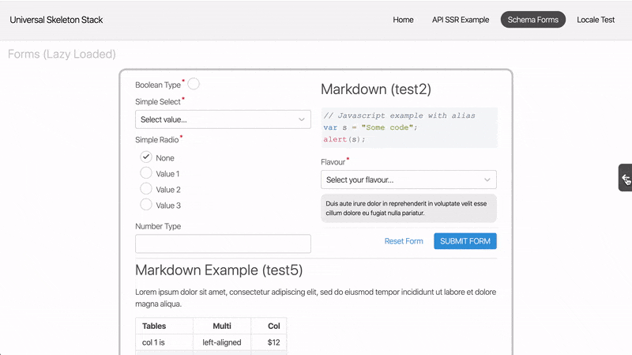

# react-wireframes [](https://travis-ci.org/matt-dunn/react-wireframes) [](https://www.npmjs.com/package/@matt-dunn/react-wireframes)

[](https://sonarcloud.io/dashboard?id=matt-dunn_react-wireframes)
[](https://sonarcloud.io/dashboard?id=matt-dunn_react-wireframes)
[](https://sonarcloud.io/dashboard?id=matt-dunn_react-wireframes)
[](https://sonarcloud.io/dashboard?id=matt-dunn_react-wireframes)
[](https://sonarcloud.io/dashboard?id=matt-dunn_react-wireframes)
[](https://sonarcloud.io/dashboard?id=matt-dunn_react-wireframes)

React component to annotate your components — useful for prototypes and proof of concepts.

---

[Storybook](https://matt-dunn.github.io/react-wireframes/storybook/?path=/story/)

[Demo](https://matt-dunn.github.io/react-wireframes/)

[CodePen](https://codepen.io/matt-j-dunn/pen/NWqZmQY?editors=0010)

---

## Getting Started

```sh
npm install --save @matt-dunn/react-wireframes
```

or

```sh
yarn add @matt-dunn/react-wireframes
```

### Annotate a component

```jsx
const AnnotatedMyComponent = withWireframeAnnotation({
    title: "MyComponent title",
    description: "MyComponent description.",
})(MyComponent);
```

### Wrap your application with the container

```jsx
  <WireframeContainer>
    <AnnotatedMyComponent />
    {/*...application*/}
  </WireframeContainer>
```

## API

See [Storybook](https://matt-dunn.github.io/react-wireframes/storybook/?path=/story/).

## Example Implementation

This example shows a set of components annotated using ```react-wireframes```. 




## Simple bare-bones example

```jsx
import ReactDOM from "react-dom";
import React from "react";

import {
    WireframeContainer, withWireframeAnnotation,
} from "@matt-dunn/react-wireframes";

const MyComponent = () => <article>Hello world</article>;

const AnnotatedMyComponent = withWireframeAnnotation({
    title: "MyComponent title",
    description: "MyComponent description.",
})(MyComponent);

const app = (
  <WireframeContainer>
      <AnnotatedMyComponent />
  </WireframeContainer>
);

ReactDOM.render(
  app,
  document.getElementById("app"),
);
```

## License

The MIT License (MIT) Copyright (c) 2020 Matt Dunn
